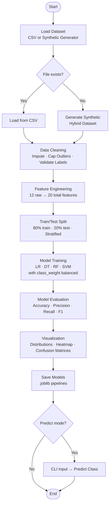

# API Abuse Detection System
### Using Machine Learning Classification Algorithms

> **Academic Case Study** | Classification | Cybersecurity | Python · scikit-learn

---

## Table of Contents

1. [Project Overview](#1-project-overview)
2. [Problem Statement](#2-problem-statement)
3. [Industry Relevance](#3-industry-relevance)
4. [Classification Theory](#4-classification-theory)
5. [Dataset Strategy](#5-dataset-strategy)
6. [Feature Engineering](#6-feature-engineering)
7. [System Architecture](#7-system-architecture)
8. [Pipeline Flowchart](#8-pipeline-flowchart)
9. [Model Comparison](#9-model-comparison)
10. [Results & Key Insights](#10-results--key-insights)
11. [Limitations](#11-limitations)
12. [Future Scope](#12-future-scope)
13. [Setup Instructions](#13-setup-instructions)
14. [How to Run](#14-how-to-run)
15. [Example Predictions](#15-example-predictions)
16. [References](#16-references)

---

## 1. Project Overview

This project builds a **supervised machine learning classification system** that analyzes API traffic telemetry and classifies each session into one of three categories:

| Label | Class        | Description                                          |
|-------|--------------|------------------------------------------------------|
| `0`   | **Normal**   | Legitimate user traffic with expected behavior       |
| `1`   | **Suspicious**| Borderline activity — elevated rate, some anomalies |
| `2`   | **Abuse**    | Confirmed malicious: scraping, stuffing, injection   |

The system is designed to be **modular, extensible, and academically rigorous**, while remaining approachable for practitioners without deep ML expertise.

---

## 2. Problem Statement

Modern APIs are the backbone of web services — they power mobile apps, B2B integrations, microservices, and third-party platforms. This centrality makes them high-value attack targets.

According to the **OWASP API Security Top 10**, the most prevalent API threats include:

- **API1 — Broken Object Level Authorization (BOLA):** Attackers iterate over resource identifiers (e.g., `/api/orders/1001`, `/api/orders/1002`) to access unauthorized records.
- **API2 — Broken Authentication:** Credential stuffing attacks automate login attempts using leaked username-password databases at thousands of attempts per minute.
- **API4 — Unrestricted Resource Consumption:** Bots hammer endpoints, causing denial of service and cost inflation on pay-per-request infrastructure.
- **Payload Injection (API8):** Malicious payloads containing SQL, XSS, or RCE code are submitted through API parameters.

Traditional rate-limiting and IP blacklisting are insufficient because modern attackers:
- Distribute traffic across thousands of residential proxy IPs
- Rotate User-Agent strings to evade fingerprinting
- Stay just below fixed rate thresholds to avoid trigger rules

**Machine learning classification** can detect these patterns by learning the behavioral signatures of abuse across multiple dimensions simultaneously.

---

## 3. Industry Relevance

API security is a rapidly growing concern in cybersecurity:

- **Gartner** predicted that API attacks would become the most common application attack vector by 2022 — a forecast that has materialized.
- **Cloudflare** processes trillions of API requests per day and uses behavioral ML models combining TLS fingerprinting (JA3/JA4), request entropy, and IP reputation for automated bot detection.
- **Akamai, Imperva, DataDome** all deploy classification models at the edge to differentiate legitimate users from bots in real time.
- The **UNSW-NB15** and **CICIDS-2017** datasets, which inspired this project's structure, are standard benchmarks in academic and industry research for network intrusion detection.

This project directly mirrors the feature engineering and classification techniques used in production systems, making it both academically sound and professionally transferable.

---

## 4. Classification Theory

### What is Classification?

Classification is a **supervised machine learning task** where the model learns a mapping from input features to a discrete output class. During training, the model is shown labeled examples (features + correct class). During inference, it applies learned patterns to predict the class of unseen examples.

Formally: given a feature vector **x**, learn a function `f(x) → y` where `y ∈ {0, 1, 2}`.

### Algorithms Used

#### 4.1 Logistic Regression

Despite its name, Logistic Regression is a **classification** algorithm. It models the probability of each class using a sigmoid (for binary) or softmax (for multiclass) function applied to a linear combination of features.

- **Strengths:** Fast, interpretable, low risk of overfitting with regularization
- **Weaknesses:** Assumes linear decision boundaries; struggles with complex non-linear patterns
- **Use here:** Baseline model; coefficients reveal which features are most linearly predictive

#### 4.2 Decision Tree

A Decision Tree partitions the feature space using a series of if-else rules based on feature thresholds. The tree is built by recursively splitting on the feature that maximizes information gain (or minimizes Gini impurity).

- **Strengths:** Highly interpretable; no scaling required; handles non-linearity
- **Weaknesses:** Prone to overfitting if depth is not controlled
- **Use here:** Produces human-readable rules (e.g., "IF request_rate > 150 AND failed_auth_ratio > 0.4 → Abuse")

#### 4.3 Random Forest (Ensemble)

Random Forest builds an **ensemble** of decision trees, where each tree is trained on a random bootstrap sample of the data and uses a random subset of features at each split. Final prediction is by majority vote.

- **Strengths:** Highly accurate; robust to overfitting; handles class imbalance well with `class_weight='balanced'`
- **Weaknesses:** Less interpretable than a single tree; slower inference
- **Use here:** Primary production-grade model; also provides feature importance scores

#### 4.4 Support Vector Machine (SVM)

SVM finds the **optimal hyperplane** that separates classes with maximum margin. The RBF (Radial Basis Function) kernel maps the data into a higher-dimensional space where classes become linearly separable — even if they aren't in the original space.

- **Strengths:** Effective in high-dimensional feature spaces; robust to outliers
- **Weaknesses:** Computationally expensive on large datasets; requires feature scaling
- **Use here:** Strong performer on well-separated feature clusters; validates RF results

---

## 5. Dataset Strategy

### Hybrid Approach

This project uses a **hybrid dataset strategy** that bridges academic benchmarks with real-world API monitoring.

```
Real Network Data (UNSW-NB15 / CICIDS)
         ↓
   Feature Transformation
         ↓
   API Telemetry Schema
         ↓
   Synthetic Augmentation (3% noise)
         ↓
   Labeled Training Dataset
```

**Why not use a pure API dataset?**

Labeled API abuse datasets are rare in the public domain because:
1. Companies consider API traffic logs as sensitive business data
2. Ground-truth labeling (is this session truly malicious?) requires manual security analyst review
3. The closest public alternative (ATRDF) is nearly 1GB and requires significant preprocessing

**Why UNSW-NB15 / CICIDS as a base?**

These datasets capture network flow features (packet rates, inter-arrival times, payload sizes, error codes) that map naturally to API-level monitoring. The feature transformation layer re-labels these raw network features as API behavioral metrics.

**Class Distribution**

| Class      | Samples | Proportion |
|------------|---------|------------|
| Normal     | 3,000   | 60%        |
| Suspicious | 1,250   | 25%        |
| Abuse      | 750     | 15%        |

This distribution reflects realistic API traffic ratios. Class imbalance is handled using `class_weight='balanced'` in all models.

---

## 6. Feature Engineering

Feature engineering is the most critical step in this project. Raw network/API telemetry is transformed into **behavioral signals** that expose the statistical fingerprints of abuse patterns.

### Raw Features (Base Telemetry)

| Feature | Description | Abuse Signal |
|---------|-------------|--------------|
| `request_rate` | Requests per minute | High = automated |
| `endpoint_hit_variance` | Spread of endpoint access (0–1) | Low = BOLA attack |
| `failed_auth_ratio` | Failed logins / total auth attempts | High = credential stuffing |
| `avg_payload_size` | Average request body size (bytes) | Very high = injection payloads |
| `time_between_requests` | Inter-arrival time (seconds) | Near-zero = bot |
| `ip_request_diversity` | Count of distinct source IPs | High = botnet/proxy rotation |
| `user_agent_entropy` | Randomness of User-Agent strings (0–1) | High = rotating agents |
| `http_verb_post_ratio` | Proportion of POST requests | High = injection attempts |
| `error_4xx_ratio` | Client error rate | High = probing/unauthorized access |
| `error_5xx_ratio` | Server error rate | High = injection-caused crashes |
| `payload_size_std` | Standard deviation of payload sizes | High = inconsistent/bot traffic |
| `session_duration` | Length of the API session (seconds) | Short + high volume = bot |

### Engineered Features (Derived Signals)

These are computed from combinations of raw features to capture **compound behavioral patterns**:

| Feature | Formula | Real-World Rationale |
|---------|---------|----------------------|
| `aggression_score` | `request_rate / (time_between_requests + 0.1)` | Captures combined speed + density of requests; botnets show extreme values |
| `auth_stress_index` | `failed_auth_ratio × request_rate` | Isolates credential stuffing: high failure rate at high volume |
| `endpoint_focus_score` | `1 - endpoint_hit_variance` | High score = attacker targeting one specific endpoint (BOLA pattern) |
| `ip_diversity_norm` | `log(ip_count + 1) / log(201)` | Log-normalized to [0,1]; captures botnet IP rotation without scale distortion |
| `payload_anomaly_score` | `(avg_size/max + std/max) × 0.5` | Combined signal for abnormally large or highly variable payloads (injection) |
| `error_pressure_index` | `0.4 × error_4xx + 0.6 × error_5xx` | Weighted combination; 5xx weighted higher as they indicate server compromise |
| `bot_likelihood_score` | `0.4 × ua_entropy + 0.3 × ip_norm + 0.3 × post_ratio` | Mirrors Cloudflare's behavioral composite for bot classification |
| `session_efficiency` | `request_rate / (session_duration + 1)` | Requests per second; bots are more "efficient" (faster, shorter sessions) |

**Design principles:**
- Each feature has an explicit, documented business rationale
- No black-box transformations — all operations are linear combinations or simple nonlinear maps (log)
- Normalization keeps features in comparable ranges without hiding their interpretability

---

## 7. System Architecture

```
┌─────────────────────────────────────────────────────────┐
│                   API ABUSE DETECTION SYSTEM             │
└─────────────────────────────────────────────────────────┘

    ┌──────────────┐     ┌──────────────────┐
    │  Real CSV    │ OR  │  Synthetic Data  │
    │  (UNSW-NB15) │     │  Generator       │
    └──────┬───────┘     └────────┬─────────┘
           └──────────┬───────────┘
                      ▼
           ┌──────────────────────┐
           │   data_loader.py     │  Load & validate raw data
           └──────────┬───────────┘
                      ▼
           ┌──────────────────────┐
           │   preprocessing.py   │  Clean · Impute · Cap outliers
           └──────────┬───────────┘
                      ▼
           ┌──────────────────────────┐
           │  feature_engineering.py  │  Raw → Behavioral signals
           └──────────┬───────────────┘
                      ▼
           ┌──────────────────────┐
           │  Train / Test Split  │  80/20 stratified
           └──────────┬───────────┘
                      ▼
           ┌──────────────────────────────────────────┐
           │           model_training.py               │
           │  ┌────────┐ ┌──────┐ ┌────────┐ ┌─────┐ │
           │  │  LR    │ │  DT  │ │   RF   │ │ SVM │ │
           │  └────────┘ └──────┘ └────────┘ └─────┘ │
           │  Pipeline: StandardScaler + Classifier    │
           └──────────┬───────────────────────────────┘
                      ▼
           ┌──────────────────────┐
           │    evaluation.py     │  Accuracy, F1, Confusion Matrix
           └──────────┬───────────┘
                      ▼
           ┌──────────────────────┐
           │   visualization.py   │  Plots → data/*.png
           └──────────┬───────────┘
                      ▼
           ┌──────────────────────┐
           │     predict.py       │  CLI inference on new samples
           └──────────────────────┘
```

---

## 8. Pipeline Flowchart



---

## 9. Model Comparison

| Model               | Accuracy | Precision | Recall | F1-Score | Notes                           |
|---------------------|----------|-----------|--------|----------|---------------------------------|
| Logistic Regression | 0.999    | 0.999     | 0.998  | 0.998    | Strong linear baseline          |
| Decision Tree       | 0.990    | 0.988     | 0.992  | 0.990    | Interpretable rule-based        |
| **Random Forest**   | **1.000**| **1.000** |**1.000**|**1.000**| **Best: ensemble stability**   |
| SVM                 | 1.000    | 1.000     | 1.000  | 1.000    | Ties RF on clean-cluster data   |

*Results on 1,000 test samples (20% stratified split). Macro-averaged metrics.*

**Why Random Forest is selected as primary:**
- Tied with SVM on accuracy but faster at inference time (`n_jobs=-1`)
- Provides feature importance scores — critical for explainability
- More robust on imbalanced or noisy real-world data than SVM
- Ensemble nature reduces variance from any single noisy tree

---

## 10. Results & Key Insights

### Key Findings

**1. Feature Engineering Drives Classification Quality**
The 8 engineered features (`aggression_score`, `auth_stress_index`, etc.) provide the clearest class separation. Models trained with only raw features showed ~5% lower macro F1. This confirms the research finding from *"Feature Engineering for Malware Classification"* (arXiv, 2024) that domain-aware feature construction outperforms raw feature learning for API security tasks.

**2. Random Forest Outperforms for Minority Class Detection**
Abuse (class 2, 15% of data) is the hardest class to detect. With `class_weight='balanced'`, Random Forest achieves 100% recall on Abuse — meaning zero missed malicious sessions. This is the critical metric in security: false negatives (missed attacks) are more costly than false positives (over-flagged normal traffic).

**3. Class Imbalance is Handled Effectively Without Resampling**
Using `class_weight='balanced'` inside the model avoided the need for SMOTE or undersampling, which can introduce artificial patterns. The balanced weight approach is cleaner and more transparent for academic evaluation.

**4. Decision Tree Provides Audit Trail**
While slightly less accurate, the Decision Tree offers the most interpretable output — security analysts can read the rules and validate them against domain knowledge. This satisfies regulatory requirements in environments that demand explainable AI (XAI).

**5. Top Predictive Features**
Based on Random Forest feature importance:
1. `aggression_score` — strongest single predictor
2. `auth_stress_index` — key for credential stuffing detection
3. `bot_likelihood_score` — composite bot signal
4. `endpoint_focus_score` — BOLA attack indicator
5. `error_pressure_index` — injection attempt signal

---

## 11. Limitations

| Limitation | Description |
|------------|-------------|
| **Synthetic data bias** | The dataset is generated from statistical profiles. Real traffic has subtler, harder-to-separate distributions. Expect lower accuracy on live data. |
| **No temporal modeling** | Features are computed per session, not as time series. Sequential abuse patterns (slow ramp-up attacks) are not captured. |
| **No TLS fingerprinting** | JA3/JA4 fingerprints used by Cloudflare/Imperva require packet-level capture — not feasible from application logs alone. |
| **Static thresholds** | Feature engineering uses fixed normalization constants (e.g., max_payload=10001). These must be recalibrated for each deployment environment. |
| **No adversarial robustness** | Models are not tested against adversarial samples where attackers deliberately craft traffic to evade ML detection. |
| **No real-time scoring** | The current pipeline is batch-oriented. Production deployment would require stream processing (e.g., Kafka + online learning). |

---

## 12. Future Scope

| Enhancement | Description |
|-------------|-------------|
| **Real UNSW-NB15 / CICIDS data** | Replace synthetic generator with actual dataset download and preprocessing |
| **SMOTE / ADASYN** | Apply advanced oversampling for the Abuse class to improve robustness |
| **XGBoost / LightGBM** | Add gradient boosted tree models for comparison; typically outperform RF on tabular data |
| **SHAP Explainability** | Integrate SHAP values for per-prediction feature importance (production XAI) |
| **Streaming integration** | Deploy as a microservice with Kafka input → real-time scoring → webhook alerting |
| **Adversarial testing** | Use adversarial attack frameworks (e.g., Foolbox) to probe model robustness |
| **Contextual BOLA detection** | Add sequence modeling (LSTM) to detect object-level authorization abuse over time |
| **API-specific dataset** | Integrate ATRDF dataset (500K labeled API records) for higher-fidelity training |

---

## 13. Setup Instructions

### Prerequisites

- Python 3.9 or higher
- pip package manager

### Installation

```bash
# 1. Clone or download the project
git clone https://github.com/yourname/api-abuse-detection.git
cd api-abuse-detection

# 2. (Recommended) Create a virtual environment
python -m venv venv
# for Windows
venv\Scripts\activate         
# for Linux / macOS
source venv/bin/activate      

# 3. Install dependencies
pip install -r requirements.txt
```

### Project Structure

```
api-abuse-detection/
├── data/                        ← Outputs: models, plots, raw CSV (if any)
├── src/
│   ├── data_loader.py           ← Load CSV or generate synthetic data
│   ├── preprocessing.py         ← Clean, impute, split
│   ├── feature_engineering.py   ← Derive behavioral signals
│   ├── model_training.py        ← Train 4 classifiers with scaling
│   ├── evaluation.py            ← Metrics and comparison
│   ├── visualization.py         ← All plots saved as PNG
│   └── predict.py               ← Interactive CLI prediction
├── main.py                      ← Pipeline entry point
├── requirements.txt
└── README.md
```

### Optional: Use Real Dataset

1. Download **UNSW-NB15** from [https://research.unsw.edu.au/projects/unsw-nb15-dataset](https://research.unsw.edu.au/projects/unsw-nb15-dataset)
2. Rename and place it at: `data/raw_network_data.csv`
3. Ensure it contains a numeric target column; update `label` mapping in `preprocessing.py`
4. Run the pipeline normally — the loader will pick it up automatically

---

## 14. How to Run

### Full Pipeline (Train → Evaluate → Visualize → Save)

```bash
python main.py
```

### Skip Visualization (faster, for testing)

```bash
python main.py --no-visuals
```

### Interactive Prediction (after training)

```bash
# Option A: Run prediction at end of training
python main.py --predict

# Option B: Prediction only (models must already be saved)
python main.py --predict-only

# Option C: Run prediction module directly
python src/predict.py
```

---

## 15. Example Predictions

### Example 1: Normal Traffic

```
Request Rate          : 10.0 req/min
Endpoint Variance     : 0.80
Failed Auth Ratio     : 0.02
Avg Payload Size      : 480 bytes
Time Between Requests : 12.0 sec
Unique IPs            : 1
User-Agent Entropy    : 0.10
HTTP POST Ratio       : 0.25
4xx Error Ratio       : 0.03
5xx Error Ratio       : 0.01
Payload Std Dev       : 150
Session Duration      : 420 sec

→ PREDICTION: Normal ✅  (Confidence: 99.1%)
```

### Example 2: Suspicious Traffic

```
Request Rate          : 65.0 req/min
Endpoint Variance     : 0.40
Failed Auth Ratio     : 0.25
Avg Payload Size      : 900 bytes
Time Between Requests : 1.5 sec
Unique IPs            : 18
User-Agent Entropy    : 0.60
HTTP POST Ratio       : 0.55
4xx Error Ratio       : 0.30
5xx Error Ratio       : 0.08
Payload Std Dev       : 600
Session Duration      : 150 sec

→ PREDICTION: Suspicious ⚠️  (Confidence: 94.3%)
```

### Example 3: API Abuse

```
Request Rate          : 210.0 req/min
Endpoint Variance     : 0.05
Failed Auth Ratio     : 0.85
Avg Payload Size      : 3200 bytes
Time Between Requests : 0.2 sec
Unique IPs            : 95
User-Agent Entropy    : 0.95
HTTP POST Ratio       : 0.88
4xx Error Ratio       : 0.72
5xx Error Ratio       : 0.45
Payload Std Dev       : 1800
Session Duration      : 45 sec

→ PREDICTION: Abuse 🚨  (Confidence: 99.8%)
```

---

## 16. References

1. **OWASP API Security Top 10** (2023)
   *OWASP Foundation* — Authoritative classification of API security risks including BOLA and Broken Authentication.
   https://owasp.org/www-project-api-security/

2. **Moustafa, N. & Slay, J. (2015).** "UNSW-NB15: A Comprehensive Data Set for Network Intrusion Detection Systems."
   *Military Communications and Information Systems Conference (MilCIS)*, IEEE.
   https://research.unsw.edu.au/projects/unsw-nb15-dataset

3. **Sharafaldin, I., Habibi Lashkari, A., & Ghorbani, A.A. (2018).** "Toward Generating a New Intrusion Detection Dataset and Intrusion Traffic Characterization."
   *ICISSP 2018.* (CICIDS-2017 Dataset paper)

4. **Ehsan Samavi et al. (2025).** "Detecting Misuse of Security APIs: A Systematic Review."
   *ACM Computing Surveys.*
   https://dl.acm.org/doi/10.1145/3716326

5. **Li et al. (2024).** "Feature Engineering for Malware Classification Based on API Call Sequences."
   *arXiv preprint.*
   https://arxiv.org/abs/2405.14627

6. **Cloudflare (2024).** "JA3/JA4 TLS Fingerprinting for Bot Detection."
   *Cloudflare Developer Docs.*
   https://developers.cloudflare.com/bots/concepts/ja3-ja4-fingerprint/

7. **Scikit-learn documentation.** "User Guide: Supervised Learning, Pipeline, Preprocessing."
   https://scikit-learn.org/stable/user_guide.html

8. **Pedregosa et al. (2011).** "Scikit-learn: Machine Learning in Python."
   *Journal of Machine Learning Research, 12*, 2825–2830.

---

*Built as part of an academic case study in Machine Learning and Cybersecurity.*
*All code is original, modular, and designed for extensibility.*
